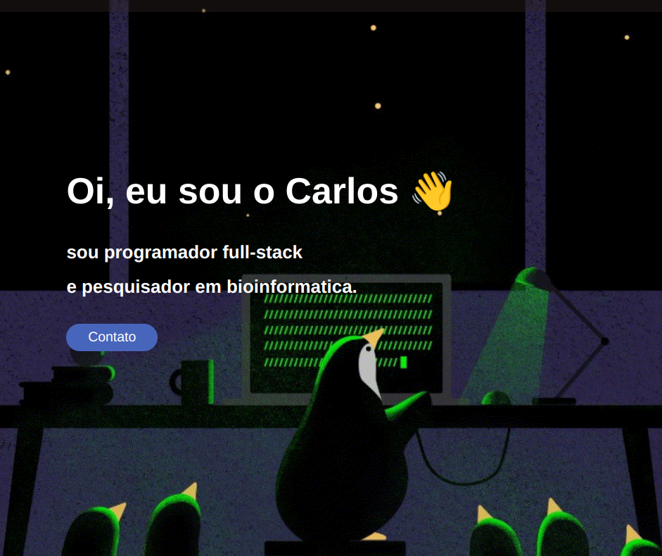

# Portfólio - Carlos Eduardo

Bem-vindo ao meu portfólio! 🎨🚀

Este site é uma coleção dos meus projetos, experiências e habilidades. Aqui, você encontrará exemplos de trabalhos que desenvolvi, assim como um pouco sobre minha trajetória acadêmica e profissional. Sinta-se à vontade para explorar e conhecer mais sobre o que eu faço.

### Acesse o portfólio:
🔗 [https://carlistosdev.netlify.app/](https://carlistosdev.netlify.app/)

## Sobre Mim

Sou estudante de Análise e Desenvolvimento de Sistemas, com foco em desenvolvimento de software e análise de dados. Tenho experiência em programação, automação de processos e projetos de pesquisa em bioinformática. Estou sempre em busca de aprender novas tecnologias e aplicar soluções criativas para desafios técnicos.

## Contato

    
    
    

